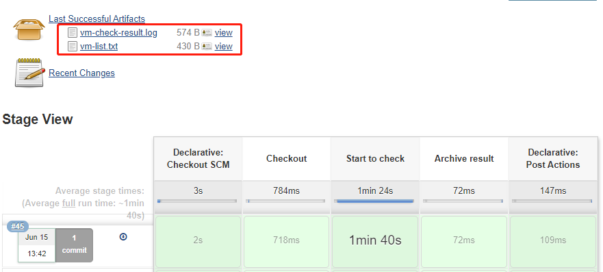
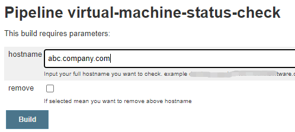
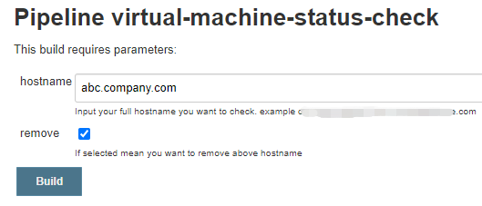

# VMM

Jenkins integration with virtual machine management (VMM)

## Requirements

Realize regular batch login to remote virtual machines and then perform some specified operations, and also support users to add and remove hostname from the vm-list.txt

A simple shell script can achieve regular ssh login operations, but how to achieve more elegant will take some time, such as:

* Regular automatic execution
* Output more intuitive login test results
* Support users to add and rmove hostname from the vm list to be checked
* After the execution is completed, notify the user and so on.

Refer to the repository code. Please note that the code here is just an example, may be has some execution failures, but I think you'll be able to fix them very soon.

## How it works like?

Just run the Jenkins pipeline, the results will be found in `vm-check-result.log` file and checked VMs could be found in `vm-list.txt`



### Supports three parameters to run

#### Default parameter execution

* The timing is executed according to the default parameters, result could be found in archive artifacts, like this

  ```
  #####################################################
  ######### VM login check via SSH results ############
  #####################################################
  #                                                   #
  # Compelted (success) 15/15 (total) login vm check. #
  #                                                   #
  #####################################################
  ```

#### Build with parameter: add a hostname 

* If user wants to add a hostname to VM list, they can input the hostname at the build page, like below

  

* Then the new result will find in archive artifacts, like this

  ```
  #####################################################
  ######### VM login check via SSH results ############
  #####################################################
  #                                                   #
  # Compelted (success) 15/16 (total) login vm check. #
  #                                                   #
  # Below 1 host(s) login faied, need to check.       #
  #                                                   #
      abc.company.com 
  #                                                   #
  #####################################################
  ```
#### Build with parameter: remove a hostname

* If user wants to remove a hostname from VM list, they can input the hostname and select remove button at the build page, like below

  

* The results will back to the first one.
  